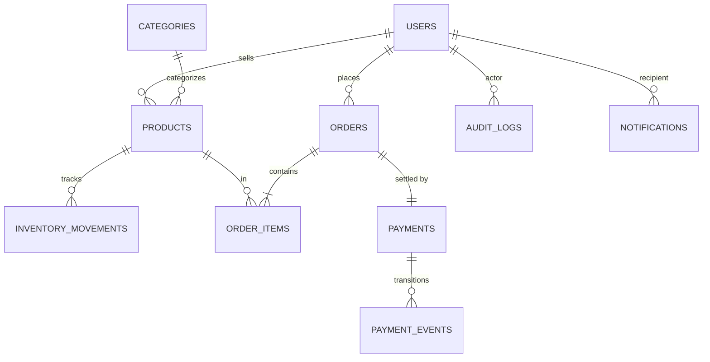

# ShopFlow

Event-driven e-commerce backend. FastAPI + PostgreSQL + Redis + ARQ workers, fully async.

See `CLAUDE.md` for full architecture, conventions, and dependency policy.

## Quickstart

```bash
# 1. Install
uv sync

# 2. Configure
cp .env.example .env
# Edit JWT_SECRET (use: openssl rand -hex 32) and DATABASE_URL

# 3. Bring up Postgres + Redis
docker compose up postgres redis -d

# 4. Migrate
uv run alembic upgrade head

# 5. Run API + worker (separate terminals)
uv run uvicorn app.main:app --reload
uv run arq app.workers.tasks.WorkerSettings
```

API docs: <http://localhost:8000/docs>

## Full Docker

```bash
docker compose up --build
```

Brings up postgres, redis, migrate (one-shot), api, worker. API at `:8000`.

## Layout

```
app/
├── api/v1/         # routers (auth, categories, products, inventory, orders, admin)
├── core/           # config, security (JWT/bcrypt), exceptions, logging
├── db/             # async engine, session factory, Base
├── models/         # SQLAlchemy 2.x ORM
├── schemas/        # Pydantic v2 DTOs
├── repositories/   # SQL access (one per aggregate)
├── services/       # business logic (orchestrates repos)
├── workers/        # ARQ tasks (payment, notifications) + WorkerSettings
├── middleware/     # request-id, rate-limit
├── utils/
└── main.py         # app factory
alembic/            # migrations
tests/              # pytest + httpx.AsyncClient, transactional rollback per test
```

API → Service → Repository → DB. Routers never touch SQLAlchemy. Services never open sessions. Repositories never call other repos.

## Auth

JWT bearer (access + refresh). Roles: `customer` (default), `seller`, `admin`. Register, login, refresh under `/api/v1/auth`.

## Order lifecycle

`PENDING → PAYMENT_PROCESSING → CONFIRMED → SHIPPED → DELIVERED`. Cancellable up to (but not including) `SHIPPED`.

Stock decrement is **atomic** (`UPDATE ... WHERE stock >= :qty RETURNING ...`). Two concurrent orders for the last unit cannot both succeed.

## Payment simulation

`PaymentService.process` is invoked from the `process_payment` ARQ task after order creation. Outcome is randomized; `PAYMENT_SUCCESS_RATE` controls the bias. Failures raise `PaymentSimulationError`; ARQ retries up to `WorkerSettings.max_tries`. Each transition is persisted to `payment_events`.

## Tests

```bash
uv run pytest
uv run pytest tests/services/test_inventory.py -k race
```

Tests require a real Postgres (set `TEST_DATABASE_URL`). Each test runs in a SAVEPOINT-rolled-back transaction.

## Architecture diagram

```
              ┌──────────┐
              │  Client  │
              └────┬─────┘
                   │ HTTPS
              ┌────▼─────┐         ┌─────────────┐
              │ FastAPI  │◄────────┤ /docs (Swagger)
              │   API    │
              └────┬─────┘
                   │ AsyncSession
              ┌────▼─────┐
              │ Postgres │
              └────▲─────┘
                   │ AsyncSession
              ┌────┴─────┐         ┌─────────┐
              │ ARQ      │◄────────┤  Redis  │
              │ Worker   │ jobs    └─────────┘
              └──────────┘
```

## ER diagram



## Postman collection

The OpenAPI spec is the source of truth. Export a Postman collection:

```bash
uv run python scripts/export_postman.py > shopflow.postman.json
```

Then `Import → File` in Postman.
