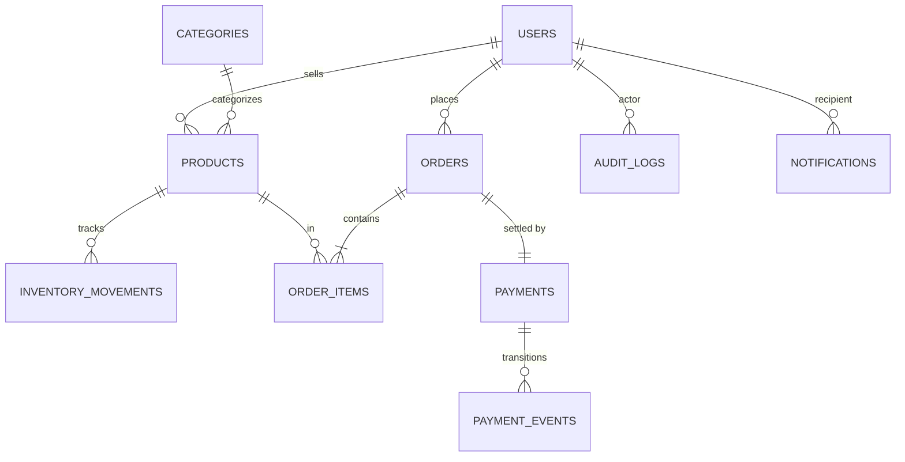

# Architecture

## High-level

```
              ┌──────────┐
              │  Client  │
              └────┬─────┘
                   │ HTTPS
              ┌────▼─────┐         ┌────────────────┐
              │ FastAPI  │─────────┤ /docs (Swagger)│
              │   API    │
              └────┬─────┘
                   │ AsyncSession (asyncpg)
              ┌────▼─────┐
              │ Postgres │
              └────▲─────┘
                   │ AsyncSession
              ┌────┴─────┐         ┌─────────┐
              │   ARQ    │◄────────┤  Redis  │
              │  Worker  │ jobs    └─────────┘
              └──────────┘
```

Single Postgres. Single Redis (broker + rate-limit). API and worker share `app.db.async_session_maker` but never share a live session — each request and each task opens its own.

## Strict layering

```
app/api  →  app/services  →  app/repositories  →  app/db (SQLAlchemy)
                                   ↑
                          app/models, app/schemas
```

| Layer | Responsibility | Forbidden |
|---|---|---|
| `app/api/` | Routers. Parse request, call a service, commit if mutating, return a schema. | `select`, `update`, `delete`, `selectinload` |
| `app/services/` | Business rules, orchestration, cross-repository transactions. Receive `AsyncSession` via DI. | Opening sessions themselves |
| `app/repositories/` | All SQLAlchemy queries. One per aggregate root. Returns ORM models. | Calling other repos |
| `app/models/` | SQLAlchemy ORM (`DeclarativeBase`, `Mapped[...]`). | — |
| `app/schemas/` | Pydantic v2 request/response DTOs. | Reusing ORM models on the wire |
| `app/workers/` | ARQ tasks. `tasks.py` registers `WorkerSettings`; `queue.py` provides `enqueue(...)` for fire-from-API. | Importing FastAPI `app` |
| `app/middleware/` | `request_context.py`, `rate_limit.py` | — |
| `app/core/` | `config.py`, `security.py`, `exceptions.py`, `logging.py`, `redis_client.py` | — |
| `app/db/` | Async engine, `async_session_maker`, `Base`, `get_async_session` DI provider | — |
| `app/utils/` | Pure helpers | Touching DB or HTTP |
| `app/main.py` | App factory: logging, routers, middleware, error handler | Anything thick |

## Module map

```
app/
├── api/v1/         routers: auth, categories, products, inventory, orders, payments, notifications, admin
├── core/           config, security (JWT + bcrypt), exceptions, logging, redis_client
├── db/             async engine, session factory, Base
├── models/         SQLAlchemy 2.x ORM
├── schemas/        Pydantic v2 DTOs
├── repositories/   SQL access (one per aggregate root)
├── services/       business logic (orchestrates repos)
├── workers/        ARQ tasks: process_payment, send_notification + WorkerSettings, queue helper
├── middleware/     request-context (request-id, access log), rate-limit (per-IP)
├── utils/
└── main.py         app factory
alembic/            migrations 0001..0007
tests/              conftest, api/, services/, workers/
scripts/            export_postman.py
```

## Error flow

Services raise typed `DomainError` subclasses from `app/core/exceptions.py`. A global handler in `app/main.py` maps them to HTTP responses with body shape `{error: {code, message, metadata}}`. Routers never build error responses inline.

| Exception | HTTP | Use |
|---|---|---|
| `NotFoundError` | 404 | Missing resource |
| `PermissionDeniedError` | 403 | RBAC or ownership |
| `InvariantViolationError` | 422 | Business rule (e.g. order not cancellable, stock insufficient) |
| `ConflictError` | 409 | Unique constraint, duplicate |
| `AuthError` | 401 | Bad credentials, expired token |
| `PaymentSimulationError` | — | Worker-only; ARQ retries it |

## ER diagram


